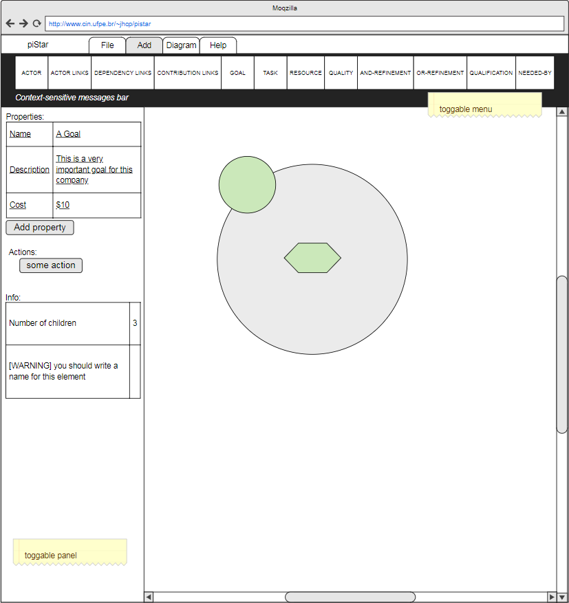

# Vision
**For** requirements engineering researchers and practitioners
**who** need to create and maintain i* models.

**The** piStar tool
**is** a modelling tool
**that** conforms to the iStar 2 standard. The models created with it present high visual fidelity, suitable for including on requirements documents, scientific documents, and web-sites. It can be customized so that other researchers can adopt it as a basis for creating their specific-purpose tools. It contains custom attributes, which help practitioners to specify their requirements. The tool runs on a web-browser without requiring additional installation.

**Unlike** existing tools,
**our product** has high visual fidelity and built-in extension functionalities, allowing researchers to create a tool to support their own i* approach.   

# User Roles

## Modeler
Needs to create an i* 2.0 model.

### Novice modeler
Computer-savvy but not very familiar with i*. Forced to create i* models by a university professor. He is aware of i*'s key concepts, but will have many doubts when creating his models.

### Advanced modeler
Has created more than a handful of i* models, perhaps using some other tool. Is very busy and cannot be bothered by technical issues. Wants to create models for illustrating scientific papers and also for teaching. Alternatively, she is designing a real system and needs to document its requirements.

## Researcher
Conducts i*-related research in an academic context. Has conceived a very nice proposal (extension/method/transformation/etc.) and now needs to create i* models to be used as input. She also wants to provide tool support for her proposal, but is pressured to meet deadlines and can't afford to spend too much time in it.

# Wireframe

# User Stories

## Release 1.2.0

  
**As a** modeler 
**I want to** have the drawing area automatically enlarged if my elements don't fit in it
 **so that** I can create models as large as I need

- *Notes*:
  - Expand to the right
  - Expand to the bottom
  - Due to technical difficulties and low value, expand to top and left were excluded from this story;
   this may be reconsidered in a future release. 
- *Tests*:
  - Try when moving expanded actor
  - Try when moving collapsed actor
  - Try when moving elements within an expanded actor
  - Try when moving dependums

## Release 1.1.0

  
**As a** modeler 
**I want to** save and load visual aspects of my model
**so that** I can reopen my diagram exactly as I left it

- *Notes*:
  - Vertices on links
  - Collapsed actors

  
**As a** modeler from a non-english speaking country
**I want to** write content that contains non-english symbols
**so that** I can create a goal model in my native language

- *Notes*:
  - المتطلبات الهندسية (Arabic)
  - 需求工程 (Chinese)
  - 要求工学 (Japanese)
  - Açafrão (Portuguese)
  - разработка требований (Russian)
  - ihtiyaç mühendisliği (Turkish)
- *Tests*:
  - Try in elements' name
  - Try in the content of a custom property
  - Try in the name of a custom property  

## Release 1.0.0

  
**As a** modeler
**I want to** add elements in the model
**so that** I can create a goal model

- *Notes*:
  - Conform to i* 2.0 standard

  
**As a** modeler
**I want to** delete elements from the model
**so that** I can create a goal model

- *Notes*:
  - delete associated links

  
**As a** modeler
**I want to** move elements in the model
**so that** I can create a goal model

- *Notes*:
  - update actor's boundary accordingly

  
**As a** modeler
**I want to** change the name of elements in the model
**so that I** can create a goal model

- *Notes*:
  - allow duplicates

  
**As a** modeler
**I want to** delete all elements in the model at once
**so that I** can create a new goal model from scratch

- *Notes*:
  - ask user to confirm

  
**As a** modeler
**I want to** collapse/expand actors in the model
  - **so that I** can create SD models
  - **so that I** can create SR models with collapsed actors

- *Notes*:
  - reposition dependency links

  
**As a** modeler
**I want to** save models offline in my computer
  - **so that** I can reopen them later and continue editing
  - **so that** I can make backups
  - **so that** I can share them with other people
  - **so that** I can edit them with other tools

- *Notes*:
  - none

  
**As a** modeler
  **I want to** export a vectorial image from my models
    - **so that** I can edit them with image editing software
    - **so that** I can add them to my documents
    - **so that** I can share them with other people

- *Notes*:
  - none
- *Tests*:
  - See if they open correctly in Inkscape (open-source image cration software)
  - Try with a selected element

  
**As a** modeler
  **I want to** export a high-resolution rasterized image from my models
    - **so that** I can add them to my documents
    - **so that** I can share them with other people

- *Notes*:
  - none
- *Tests*:
  - Try with a selected element

  
**As a** modeler
**I want to** be prevented from making mistakes regarding the syntax of iStar 2
**so that** I can create a valid goal model

- *Notes*:
  - Conform to i* 2.0 standard

  
**As a** modeler
**I want to** define custom attributes for elements in the model
**so that I** can provide additional information such as rationale, author, and fit criterion

- *Notes*:
  - none

  
**As a** modeler 
**I want to** open model examples
- **so that** I can see what is possible to do with this
modeling language and tool
- **so that** I have a starting point to tinker with in the tool

- *Notes*:
  - none

  
**As a** modeler 
**I want to** change the size of the drawing area
 **so that** I can create models as large (or as small) as I need

- *Notes*:
  - Manually define width and height

## Backlog

  
**As a** modeler 
**I want to** change the type of a dependency link
**so that** I can edit my model more easily

- *Notes*:
  - Change between Goal dependency, Quality dependency, Task dependency,
  and Resource dependency

  
**As a** modeler 
**I want to** change the type of a contribution link
**so that** I can edit my model more easily

- *Notes*:
  - Change between Make, Help, Hurt, and Break

**As a** modeler 
**I want to** flip the direction of a dependency link
**so that** I can edit my model more easily

- *Notes*:
  - TBD

  
**As a** modeler 
**I want to** define custom properties for the model itself 
 **so that** I can provide additional information such as project name, project description, and company

- *Notes*:
  - TBD

  
**As a** modeler 
**I want to** calculate metrics for my i* model 
 **so that** I can assess its quality

- *Notes*:
  - TBD

**As a** modeler 
**I want to** add custom attributes to multiple elements at once
 **so that** I can save time when creating my models

- *Notes*:
  - TBD

**As a** modeler 
**I want to** copy elements from my model
 **so that** TBD

- *Notes*:
  - TBD

**As a** modeler 
**I want to** resize my elements
 **so that** their text do not go outside the element's shape 

- *Notes*:
  - TBD

**As a** modeler 
**I want to** customize the look of my elements
 **so that** TBD 

- *Notes*:
  - TBD

**As a** modeler 
**I want to** be able to undo my recent actions
 **so that** I can correct any accident 

- *Notes*:
  - TBD

**As a** modeler 
**I want to** be able to delete custom properties
 **so that** I can remove data that is no longer needed 

- *Notes*:
  - TBD

**As a** modeler 
**I want to** be able to load language extensions at runtime
 **so that** I can document concepts that are not supported by the standard iStar 2.0 

- *Notes*:
  - TBD

